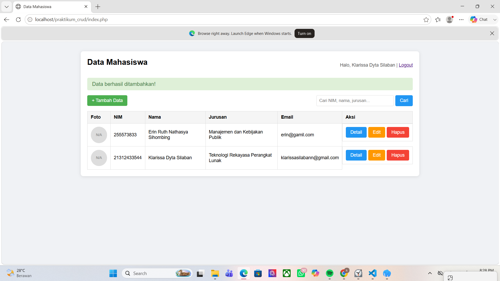

# Portofolio Praktikum Pemrograman Web 1

Kumpulan tugas Praktikum Pemrograman Web 1
Program Studi TRPL Semester 2

## Tentang Saya

| Info  | Detail          |
|-------|-----------------|
| Nama  | Klarisaa Dyta Silaban   |
| NIM   | 25/562019/SV/26741      |
| Prodi | TRPL          |

## Daftar Tugas

| Bab | Topik                   | Folder              |
|-----|-------------------------|---------------------|
| 02 | HTML Dasar               | pertemuan2-html-dasar/          |
| 03 | LinkIframeTabel          | pertemuan3-link-iframe-tabel/   |
| 04 | Form & Graphic           | pertemuan4_form-graphic/        |
| 05 | CSS                      | pertemuan5-css/                 |
| 06 | Responsive Web Design    | pertemuan6_responsivewebdesign/ |
| 07 | CSS 2                    | pertemuan7-css2/                |
| 08 | Bootstrap                | pertemuan8-bootstrap/           |
| 09 | Design Web               | pertemuan9-designwebsite/       |
| 10 | JavaSript                | pertemuan10-javascript/         |
| 11 | PHP                      | pertemuan11_php/                |
| 12 | CRUD PHP + MySQL         | pertemuan12-crudphp/            |
  
## Teknologi yang Digunakan
HTML · CSS · JavaScript · PHP · MySQL · Bootstrap

## Screenshot

